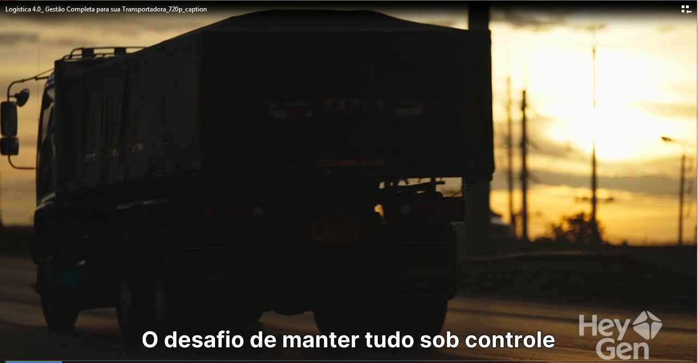

# Utilizando a I.A. para Gerar Videos Reais 

## 📒 Descrição
Este projeto tem como objetivo explorar as ferramentas de I.A. para criar videos reais corporativos.

## 🤖 Tecnologias Utilizadas
HeyGen

## 🧐 Processo de Criação
O roteiro foi criado pensando em um aplicativo de controle de entregas para transportadoras, dentro da própria 
ferramenta ja integra sistema de prompt para criação do vídeo.

## 🚀 Resultados

O video gerado encontra-se no repositório na pasta Videos!

## 💭 Reflexão (Opcional)
Cada vez mais as ferramentas de criação de videos estão evoluindo e simplificando o processos de criação
com poucos passos você ja consegue ter um video com uma qualidade satisfatória.

